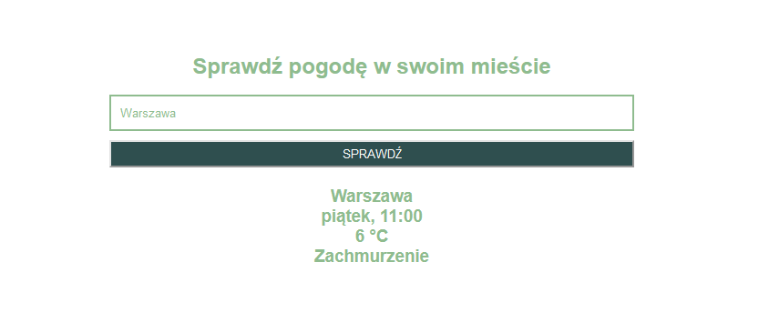
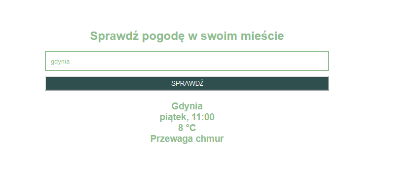

# Web Scraping z Pythonem
## Lab 5
Laboratorium miało na celu zapoznanie się z web scrapingiem z Pythonem.

W ramach laboratorium przeanalizowano kod z zajęć oraz stworzono aplikację Django wyszukującą elementy do scrapowania.

Aplikacja zawiera następujące elementy:
- formularz z jednym polem do wpisania nazwy miasta dla którego chcemy otrzymać aktualną pogodę,
- kod odpowiadający za scraping znajduje się w widoku pliku views.py,
- wyniki scrapingu przekazano za pomocą funkcji render() do szablonu html, gdzie zostają wyświetlone.

## Przykład działania programu

